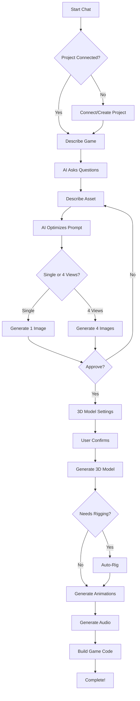
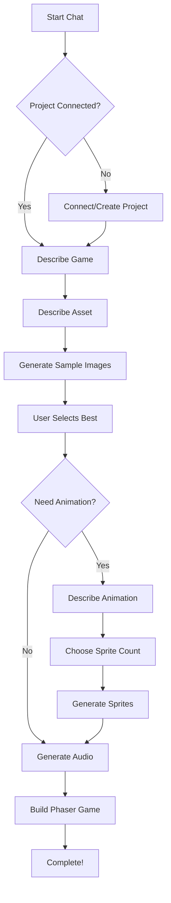

# KOYE AI - Complete Project Documentation

<div align="center">


**An AI-native game development workspace where creators build complete 2D/3D game assets through natural conversation.**

</div>

---

## 📋 Table of Contents

1. [What is KOYE AI?](#what-is-koye-ai)
2. [The Problem It Solves](#the-problem-it-solves)
3. [Key Features](#key-features)
4. [Technical Architecture](#technical-architecture)
5. [User Journey](#user-journey)
6. [API Integrations](#api-integrations)
7. [Database Architecture](#database-architecture)
8. [Project Structure](#project-structure)
9. [Credit System](#credit-system)
10. [Getting Started](#getting-started)

---

## 🎮 What is KOYE AI?

**KOYE AI** is a comprehensive AI-powered game development platform that revolutionizes how game assets are created. Instead of requiring expertise in 3D modeling software, image editing tools, or audio production, KOYE enables anyone to create professional game assets through simple natural language conversations.

### Core Concept

Users describe what they want in plain English, and KOYE's AI understands their intent, asks clarifying questions, and orchestrates multiple AI services to generate:

- 🎨 **2D Images** - Characters, environments, UI elements, sprites
- 🧱 **3D Models** - Characters, props, creatures with optional texturing
- 🎬 **Videos/Cutscenes** - Animated sequences for storytelling
- 🎵 **Audio/SFX** - Sound effects, ambient audio, voice generation
- 📄 **Game Code** - Babylon.js (3D) or Phaser (2D) game scripts

### The Vision

KOYE AI democratizes game development by removing the technical barriers that prevent creative individuals from bringing their game ideas to life. Whether you're an indie developer, a hobbyist, or someone with zero coding experience, KOYE provides the tools to create complete, playable game prototypes.

---

## 🎯 The Problem It Solves

### Traditional Game Asset Creation Challenges

| Challenge | Traditional Approach | KOYE AI Solution |
|-----------|---------------------|------------------|
| **3D Modeling** | Requires Blender/Maya expertise, weeks of learning | Describe in text → Get 3D model in minutes |
| **2D Art** | Need Photoshop/Illustrator skills | Describe character → Get production-ready images |
| **Sound Design** | Expensive software, audio engineering knowledge | Type description → Generate professional audio |
| **Animation** | Complex rigging, keyframe animation | Auto-rigging + AI-generated animations |
| **Code** | Programming knowledge required | AI generates Babylon.js/Phaser code |
| **Iteration** | Hours/days to make changes | Edit with natural language instantly |
| **Cost** | Hiring artists: $50-200/hour | Credit-based system, fraction of the cost |
| **Time** | Weeks to months for a prototype | Hours to days |

### Who Benefits?

1. **Indie Game Developers** - Prototype ideas without an art budget
2. **Game Design Students** - Learn by creating, not just theory
3. **Hobbyists** - Turn imagination into playable games
4. **Startups** - Rapid prototyping for investor demos
5. **Content Creators** - Custom assets for streams/videos
6. **Educators** - Teaching game design with instant visualizations

---

## ✨ Key Features

### 1. 🤖 AI Chat Interface (Powered by Gemini 2.5 Flash)

The heart of KOYE is a conversational AI that:
- Understands game development context
- Guides users through structured workflows (2D: 21 steps, 3D: 39 steps)
- Asks clarifying questions to optimize asset generation
- Automatically triggers generation when requirements are clear
- Provides credit cost transparency before each operation

### 2. 🎨 Multi-Model Image Generation

KOYE supports multiple image generation backends:

| Model | Quality | Speed | Use Case |
|-------|---------|-------|----------|
| **koye-2dv1** (ClipDrop) | Standard | Fast | Quick iterations |
| **koye-2dv1.5** (Pixazo/Seedream) | High Quality | Medium | Final assets |
| **koye-2dv2** (Banana) | Ultra | Slower | Premium quality |

**Special Features:**
- 4-view orthographic generation (front, left, right, back) for 3D-ready assets
- Sprite sheet generation for 2D animations (5, 11, 22, or 44 frames)
- Image editing with natural language prompts
- Background replacement for asset isolation

### 3. 🧱 Image-to-3D Model Generation

- Upload 4-view images → Get textured 3D model
- Resolution options: 512, 1024, 1536
- Optional texture generation
- Export formats: GLB, OBJ, FBX
- Integration with Hitem3D API

### 4. 🎬 Video/Cutscene Generation

- Text-to-video generation via Veo 3.1
- Use generated images as keyframes
- Configurable duration, aspect ratio, resolution
- Perfect for game cinematics and trailers

### 5. 🎵 Audio Generation

- Sound effects from text descriptions
- Adjustable duration and influence
- RapidAPI ElevenLabs integration
- Instant preview and download

### 6. 📁 Project Management (Builder)

- Create and manage game projects
- Organize assets in file system
- Real-time sync between chat and builder
- GitHub integration for version control
- Auto-save with undo/redo support

### 7. 🎮 Game Engines

- **Babylon.js Engine** - For 3D games
- **Phaser Engine** - For 2D games
- Asset import from projects
- Scene visualization and testing

### 8. 👤 User Dashboard

- View all generated assets (images, models, videos, audio)
- Project management
- Usage statistics
- GitHub connection
- Account settings

---

## 🏗️ Technical Architecture

### Frontend Stack

```
React 18 + TypeScript + Vite
├── State Management: Zustand
├── Styling: Tailwind CSS
├── 3D Rendering: Three.js + React Three Fiber + Babylon.js
├── 2D Games: Phaser 3
├── Animations: Framer Motion
└── Markdown: React Markdown + Remark GFM
```

### Backend Stack

```
Supabase (Multi-Database Architecture)
├── Main Database
│   ├── Authentication (auth.users)
│   ├── User Profiles
│   ├── Subscriptions
│   └── Projects
│
└── Data Databases (db1, db2, db3...)
    ├── Chat Sessions
    ├── Images
    ├── 3D Models
    ├── Videos
    ├── Audio
    └── Storage Buckets
```

### Multi-Database Design

KOYE uses a **sharded database architecture** for scalability:

1. **Main DB**: Auth, subscriptions, projects (stable, low-volume)
2. **Data DBs**: User-generated content (high-volume, auto-scaling)
3. **MultiDbManager**: Automatically switches to next DB when one reaches capacity
4. **Cross-DB Queries**: Dashboard aggregates data from all DBs

---

## 🚀 User Journey

### 3D Game Asset Creation Flow



### 2D Game Asset Creation Flow



---

## 🔌 API Integrations

### AI/ML APIs

| Service | Purpose | Endpoint |
|---------|---------|----------|
| **Google Gemini 2.5 Flash** | Conversational AI, prompt optimization | `generativelanguage.googleapis.com` |
| **ClipDrop** | Image generation (koye-2dv1) | `clipdrop-api.co` |
| **Pixazo** | Image generation (koye-2dv1.5), Video (Veo 3.1) | `api.piapi.ai` |
| **Banana** | Image generation (koye-2dv2) | Custom endpoint |
| **Hitem3D** | Image-to-3D model conversion | `api.hyper3d.ai` |
| **RapidAPI ElevenLabs** | Audio/SFX generation | `rapidapi.com` |
| **Meshy** | 3D model rigging | `meshy.com` |

### API Fallback System

KOYE implements robust fallback handling:

```typescript
// lib/apiFallback.ts
export const withApiFallback = async (apiCall, serviceType) => {
  const keys = getApiKeys(serviceType) // Gets all configured keys
  for (const key of keys) {
    try {
      return await apiCall(key)
    } catch (error) {
      console.warn(`Key failed, trying next...`)
    }
  }
  throw new Error('All API keys exhausted')
}
```

---

## 🗄️ Database Architecture

### Tables Structure

#### Main Database
```sql
-- Projects table
CREATE TABLE projects (
  id UUID PRIMARY KEY,
  userId UUID REFERENCES auth.users(id),
  name TEXT NOT NULL,
  description TEXT,
  createdAt TIMESTAMP DEFAULT NOW()
);

-- Subscriptions table
CREATE TABLE subscriptions (
  id UUID PRIMARY KEY,
  userId UUID REFERENCES auth.users(id),
  planId UUID REFERENCES plans(id),
  credits INTEGER DEFAULT 0,
  status TEXT
);
```

#### Data Databases (db1, db2, ...)
```sql
-- Images table
CREATE TABLE images (
  id UUID PRIMARY KEY,
  userId UUID NOT NULL,
  projectId UUID,
  assetId UUID,
  view TEXT, -- 'front', 'left', 'right', 'back'
  url TEXT NOT NULL,
  prompt TEXT,
  createdAt TIMESTAMP DEFAULT NOW()
);

-- Models table
CREATE TABLE models (
  id UUID PRIMARY KEY,
  userId UUID NOT NULL,
  projectId UUID,
  url TEXT NOT NULL,
  format TEXT, -- 'glb', 'obj', 'fbx'
  status TEXT, -- 'raw', 'textured', 'rigged'
  createdAt TIMESTAMP DEFAULT NOW()
);

-- Videos, Audio, Chat Sessions follow similar patterns
```

### Storage Buckets

Each database has dedicated storage buckets:
- `images` - Generated images
- `models` - 3D model files
- `videos` - Video files
- `audio` - Audio files
- **Project-specific buckets** - Assets organized by project ID

---

## 📂 Project Structure

```
my-app/
├── src/
│   ├── components/
│   │   ├── chat/              # Chat interface components
│   │   │   ├── ChatInterface.tsx
│   │   │   ├── ChatInput.tsx
│   │   │   └── ResponseMessage.tsx
│   │   ├── builder/           # Builder/IDE components
│   │   │   ├── BuilderSidebar.tsx
│   │   │   └── BuilderInspector.tsx
│   │   ├── workflow/          # Workflow management
│   │   │   └── WorkflowManager.tsx
│   │   ├── image-generation/  # Image gen components
│   │   ├── video-generation/  # Video gen components
│   │   ├── audio-generation/  # Audio gen components
│   │   ├── model-viewer/      # 3D model viewer
│   │   └── ui/                # Reusable UI components
│   │
│   ├── pages/
│   │   ├── Dashboard.tsx      # User dashboard
│   │   ├── Builder.tsx        # Project builder/IDE
│   │   ├── Pricing.tsx        # Subscription plans
│   │   ├── GameEngine.tsx     # Babylon.js 3D engine
│   │   └── Phaser2DGameEngine.tsx  # Phaser 2D engine
│   │
│   ├── services/
│   │   ├── gemini.ts          # Gemini AI integration
│   │   ├── clipdrop.ts        # ClipDrop image API
│   │   ├── pixazo.ts          # Pixazo image API
│   │   ├── hitem3d.ts         # 3D model generation
│   │   ├── veo3.ts            # Video generation
│   │   ├── rapidElevenLabs.ts # Audio generation
│   │   ├── multiDbManager.ts  # Multi-database manager
│   │   ├── multiDbDataService.ts  # Data operations
│   │   └── supabase.ts        # Supabase client
│   │
│   ├── store/
│   │   └── useAppStore.ts     # Zustand global state
│   │
│   ├── types/
│   │   └── index.ts           # TypeScript definitions
│   │
│   └── lib/
│       ├── apiFallback.ts     # API fallback utilities
│       └── utils.ts           # General utilities
│
├── supabase-*.sql             # Database schemas
├── package.json
└── vite.config.ts
```

---

## 💰 Credit System

KOYE uses a credit-based pricing model:

### Credit Costs

| Feature | Credits |
|---------|---------|
| **AI Chat** | 100 credits / million tokens |
| **Image (Standard)** | 5 credits |
| **Image (HQ)** | 10 credits |
| **Image (Ultra)** | 15 credits |
| **3D Model (Basic 512)** | 20 credits |
| **3D Model (Standard 1024)** | 50 credits |
| **3D Model (High-Res 1536)** | 70 credits |
| **Texture Add-on** | +5 to +20 credits |
| **Auto-Rigging** | 10 credits |
| **Animation (per clip)** | 30 credits |
| **Audio (per second)** | 5 credits |
| **2D Game Build** | 100 credits |
| **3D Game Build** | 250 credits |

### Subscription Plans

1. **FREE** - Limited credits, koye-2dv1 only
2. **PRO_TRIAL** - Trial period, basic features
3. **PRO** - Full access, monthly credit allocation
4. **ENTERPRISE** - Custom limits, priority support

---

## 🚀 Getting Started

### Prerequisites

- Node.js 18+
- npm or yarn
- Supabase account
- API keys for: Gemini, ClipDrop, Pixazo, Hitem3D, RapidAPI

### Installation

```bash
# Clone and install
git clone <repository>
cd my-app
npm install

# Configure environment
cp .env.example .env
# Edit .env with your API keys

# Run development server
npm run dev

# Build for production
npm run build
```

### Environment Variables

```env
# Supabase (Main)
VITE_SUPABASE_URL=your_url
VITE_SUPABASE_ANON_KEY=your_key

# Supabase (Data DBs)
VITE_SUPABASE_DB1_URL=your_db1_url
VITE_SUPABASE_DB1_ANON_KEY=your_db1_key
# ... db2, db3, etc.

# AI Services
VITE_GEMINI_API_KEY=your_gemini_key
VITE_CLIPDROP_API_KEY=your_clipdrop_key
VITE_PIXAZO_API_KEY=your_pixazo_key
VITE_HITEM3D_API_KEY=your_hitem3d_key
VITE_RAPIDAPI_KEY=your_rapidapi_key

# Payments
VITE_RAZORPAY_KEY_ID=your_razorpay_key
```

---

## 📈 Future Roadmap

- [ ] Complete texture generation pipeline
- [ ] Full rigging workflow integration
- [ ] Animation system with preview
- [ ] Voice chat capabilities
- [ ] Team collaboration features
- [ ] API access for developers
- [ ] Mobile application
- [ ] Marketplace for asset sharing

---

## 📄 License

MIT License - See [LICENSE](LICENSE) for details.

---

<div align="center">

**Built with ❤️ by the KOYE AI Team**

[Website](https://koye.ai) • [Documentation](https://docs.koye.ai) • [Discord](https://discord.gg/koye)

</div>
